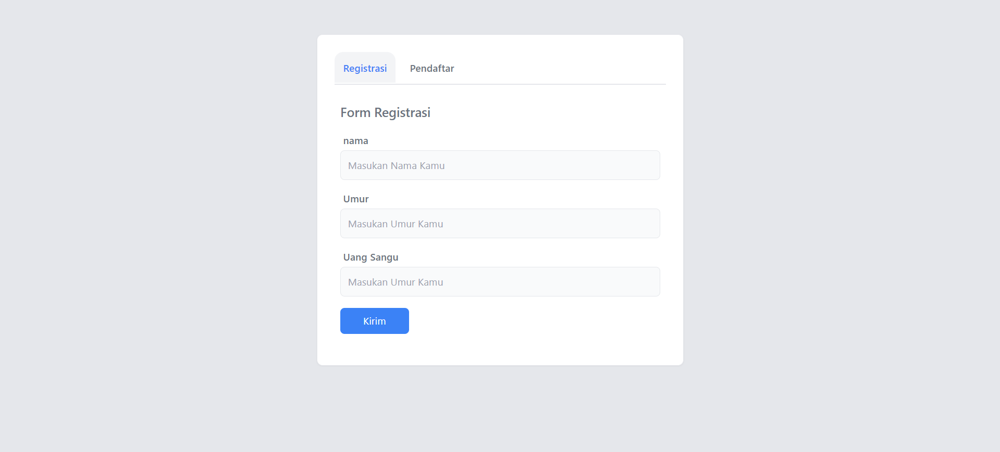
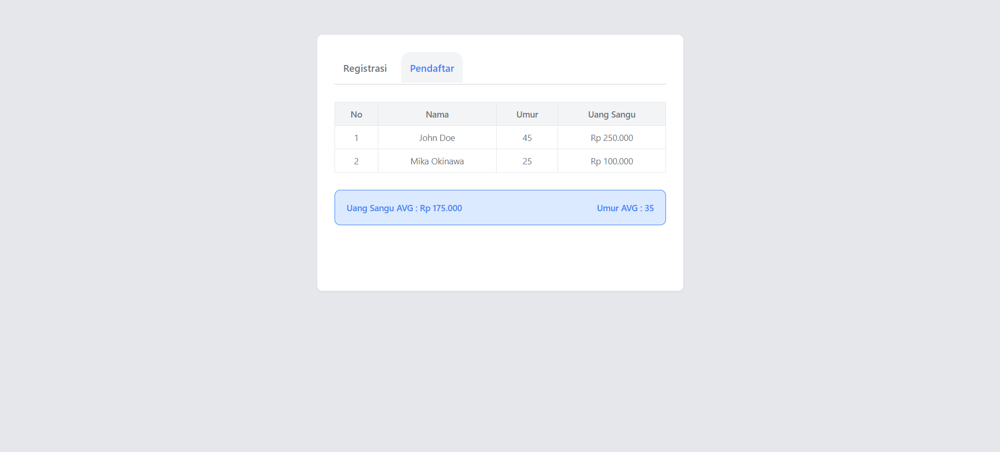

# Basic Javascript Registration Application


## Preview

### Form Registrasi



### List Pendaftar



### Demo

[Demo]: https://malixl.github.io/Rakamin-Basic-Javascript/

## Deskripsi

Aplikasi ini dirancang untuk memenuhi tugas dari Rakamin. Peserta diharapkan mampu mengimplementasikan konsep OOP, Asynchronous, dan DOM pada aplikasi ini. Aplikasi ini memiliki fitur sebagai berikut:

- Form pendaftaran dengan validasi input:
  - Nama minimal 10 karakter
  - Umur minimal 25 tahun
  - Uang sangu antara 100 ribu hingga 1 juta
- Tabel yang menampilkan daftar pendaftar dan resume statistik.

## Cara Menjalankan Program

Anda dapat menjalankan aplikasi ini dengan dua cara:

### 1. Langsung dari Browser

- Clone repository ini dengan perintah:
  ```bash
  git clone https://github.com/OnyanPokon/homework_basicjs.git
  ```
- run in terminal
  ```bash
  npm install
  ```
- run npx
  ```bash
  npx tailwindcss -i ./src/input.css -o ./src/output.css --watch
  ```
- Buka file index.html di browser.

### 2. Langsung dari Browser

- Clone repository ini dengan perintah:
  ```bash
  git clone https://github.com/OnyanPokon/homework_basicjs.git
  ```
- run in terminal
  ```bash
  npm install
  ```
- run npx
  ```bash
  npx tailwindcss -i ./src/input.css -o ./src/output.css --watch
  ```
- Buka proyek ini di Visual Studio Code.
- Install ekstensi Live Server.
- Klik kanan pada index.html dan pilih "Open with Live Server".

## Gambaran Tugas

Peserta diminta untuk membuat satu halaman yang berisi form dan tabel. Form dan tabel terpisah menjadi dua tab: Registrasi dan List Pendaftar.

### 1. Langkah-langkah Pengerjaan

- Desain layout (10 menit)
- Membuat tab Registrasi dan tab List Pendaftar (60 menit)
- Membuat mekanisme penyimpanan data dan menampilkan ke bentuk tabel (90 menit)
- Membuat resume dari tabel (30 menit)
- Push ke repo (15 menit)

### 2. Kriteria Penilaian

- Pemahaman penerapan konsep OOP
- Pemahaman penerapan konsep Asynchronous
- Implementasi DOM
- Penggunaan GIT